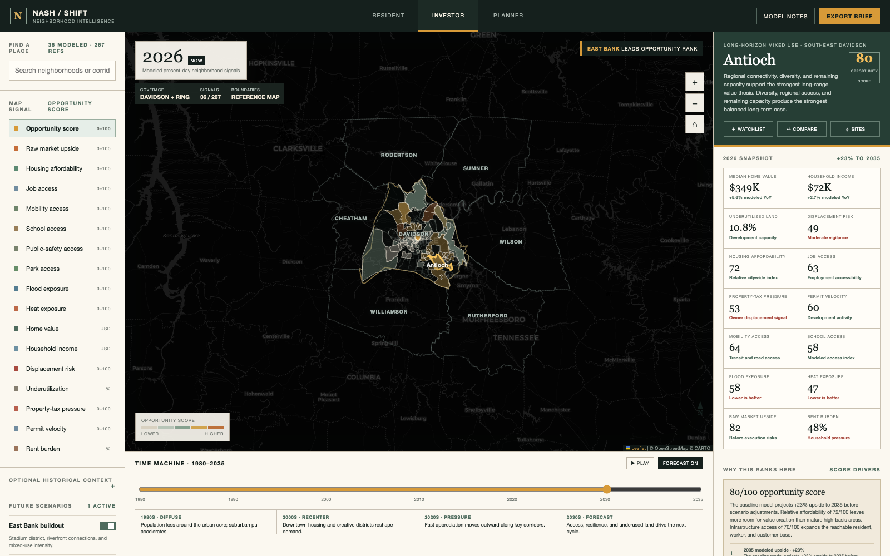

# Nash / Shift

**An interactive, time-traveling Nashville neighborhood intelligence map.**

[](https://github.com/ashbybrewer/nashville-time-machine/actions/workflows/pages.yml)
[](https://ashbybrewer.github.io/nashville-time-machine/)
[](LICENSE)

Nash / Shift explores how Nashville neighborhoods have changed, where pressure is building, and where long-term value may emerge. It combines a searchable neighborhood-boundary map, modeled historical and future conditions, an investor opportunity ranking, and address-level opportunity nodes in one browser-based tool.

> [Open the live application](https://ashbybrewer.github.io/nashville-time-machine/)



## What It Does

- Travels from **1980 through 2035** with historical and forecast modes.
- Maps **267 named neighborhoods and districts** from the supplied Nashville reference map.
- Shows **Davidson County and its six directly surrounding counties**.
- Scores and ranks **36 modeled investment areas and corridors**.
- Explains *why* each opportunity ranks where it does using its strongest score drivers and primary execution risk.
- Lets users switch among **Investor, Resident, and Planner** perspectives.
- Maps address and intersection-level opportunity nodes in **Sites mode**.
- Compares affordability, jobs, mobility, schools, safety, parks, flood exposure, heat, permits, taxes, displacement pressure, and more.
- Tests future scenarios including East Bank buildout, transit expansion, and greenway expansion.

## Opportunity Model

The opportunity score is designed to avoid treating price growth alone as opportunity. It blends:

| Upside and capacity | Access and demand | Execution and community risk |
| --- | --- | --- |
| Underutilized land | Job access | Displacement pressure |
| Relative affordability | Mobility access | Property-tax pressure |
| Market momentum | School and park access | Flood and heat exposure |
| Permit velocity | Infrastructure catalysts | Resident continuity |
| Modeled 2035 upside | Scenario effects | Entry-cost constraints |

Every ranked area includes:

1. A modeled opportunity score.
2. The top three reasons supporting the score.
3. The most important execution risk.
4. A lead address or intersection for deeper research.

The values are illustrative and intended to demonstrate the product concept. They are **not investment advice, verified property valuations, or claims that a parcel is available**.

## Map Coverage

- **Neighborhoods and districts:** 267 polygons embedded from the public [City Of Nashville, Tennessee reference map](https://www.google.com/maps/d/u/0/viewer?mid=1HMVHxQP_q3jmfNDYg1baQ3UqiKVRw-U).
- **County context:** U.S. Census Bureau TIGERweb State/County boundaries for Davidson, Cheatham, Robertson, Rutherford, Sumner, Williamson, and Wilson counties.
- **Modeled investment layer:** 36 neighborhoods, corridors, and planning-area groupings.
- **Fine-grain search:** Reference neighborhoods can be searched and are associated with the most relevant modeled area.

Nashville neighborhood identities and boundaries are community-defined and can overlap or change. The reference polygons are used as a practical visual layer, not legal boundaries.

## Run Locally

The application is static and has no build step.

```bash
git clone https://github.com/ashbybrewer/nashville-time-machine.git
cd nashville-time-machine
python3 -m http.server 4173
```

Then open [http://127.0.0.1:4173](http://127.0.0.1:4173).

You can also open `index.html` directly, although serving the directory is recommended.

## Project Structure

```text
nashville-time-machine/
├── .github/workflows/pages.yml       # GitHub Pages deployment
├── assets/
│   ├── nashville-planning-aerial.png # Dashboard editorial image
│   ├── preview.png                    # README preview
│   └── reference-boundaries.js        # Embedded neighborhood + county geometry
├── index.html                         # Entire interactive application
├── LICENSE
└── README.md
```

## Data and Methodology

The current prototype combines embedded reference geometry with modeled demonstration values. A production implementation should connect the interface to regularly refreshed sources such as:

- [Metro Nashville Community Plans](https://www.nashville.gov/departments/planning/long-range-planning/community-plans)
- [Metro Nashville Development Tracker](https://maps.nashville.gov/developmenttracker)
- [Metro Nashville Parcel Viewer](https://maps.nashville.gov/ParcelViewer/)
- [U.S. Census ACS 5-Year Data](https://www.census.gov/data/developers/data-sets/acs-5year.html)
- [U.S. Census Bureau TIGERweb](https://tigerweb.geo.census.gov/arcgis/rest/services/TIGERweb/State_County/MapServer/1)

Address-level opportunity nodes are analytical starting points. Before making a real-world decision, verify ownership, availability, zoning, entitlements, environmental conditions, flood risk, infrastructure capacity, and active development status.

## Deployment

Pushes to `main` automatically deploy the static application through GitHub Pages using [`.github/workflows/pages.yml`](.github/workflows/pages.yml).

The expected live URL is:

```text
https://ashbybrewer.github.io/nashville-time-machine/
```

## License

Released under the [MIT License](LICENSE).
